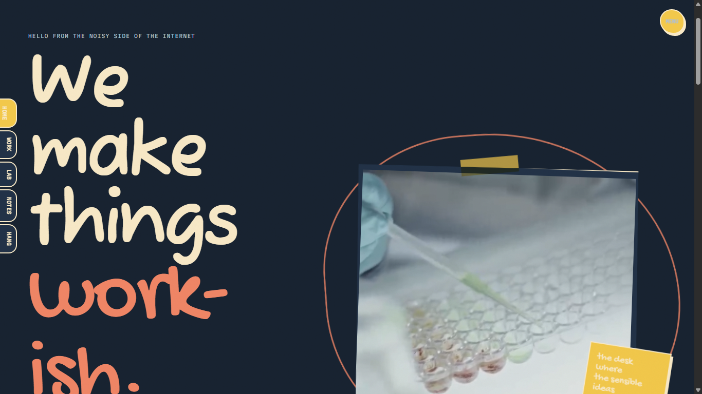
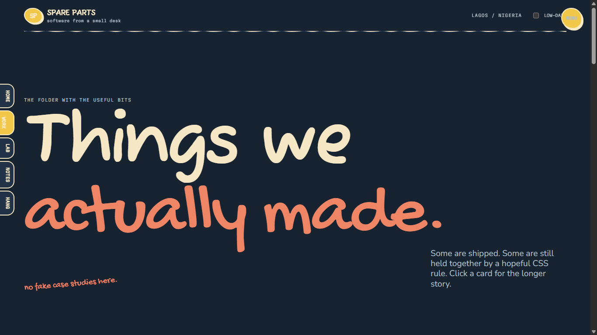
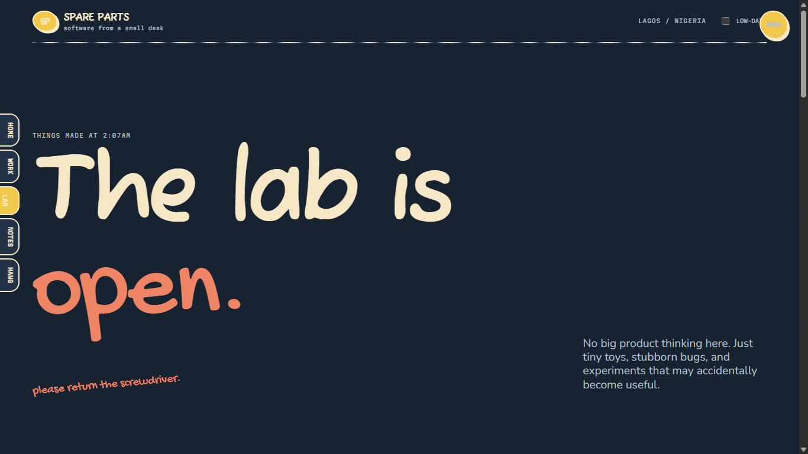
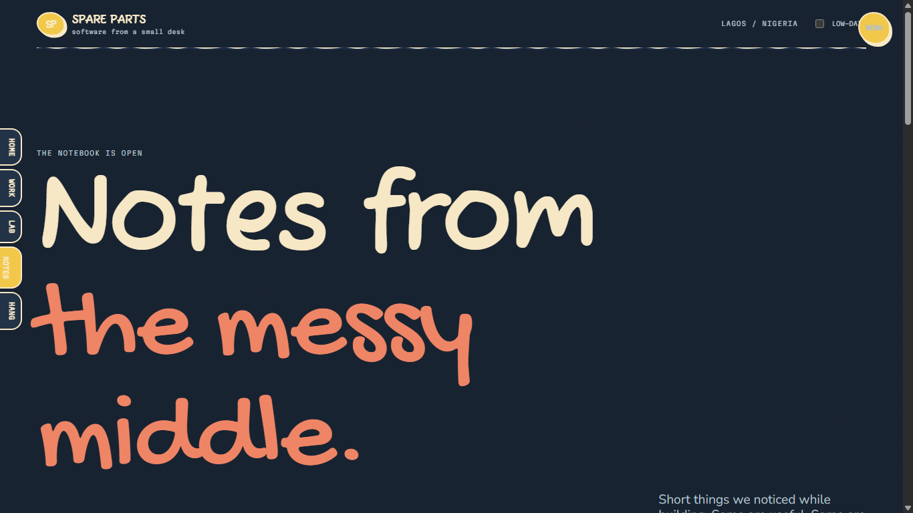
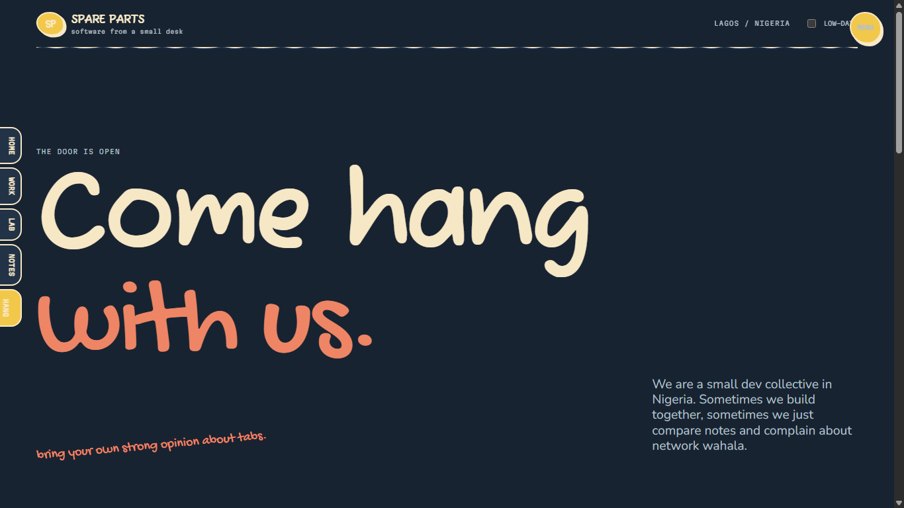
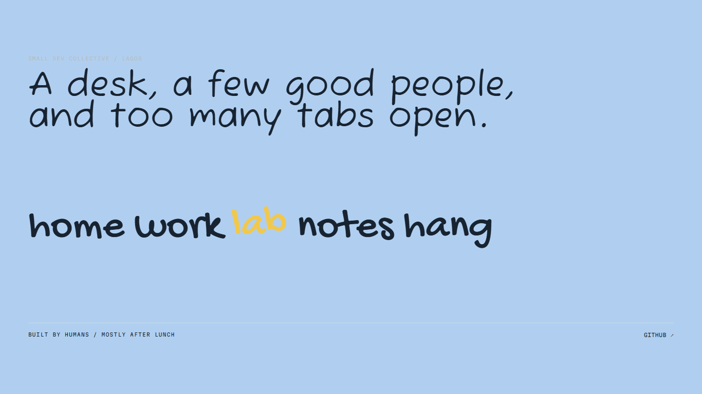

# Spare Parts

The home on the internet of a small Nigerian dev collective. The project is five static pages with shared vanilla JavaScript.

<p align="center">
  
  &nbsp;
  
</p>

<p align="center">
  
  &nbsp;
  
</p>

<p align="center">
  
  &nbsp;
  
</p>

The pages:

- `index.html` — the desk and the scribble path
- `work.html` — honest project cards and longer stories
- `lab.html` — doodle wall, excuse generator, danfo board and bug tray
- `notes.html` — filterable devlog notes
- `hang.html` — contact form, community links and a Nigeria-shaped doodle
## Run it

The pages use ES modules and page-to-page View Transitions where supported, so serve the folder over HTTP:

```sh
python -m http.server 8000
```

or:

```sh
npx serve .
```

Then open `http://localhost:8000`.

There is no build step, framework, runtime CDN, icon font or backend submission. The contact form validates in the browser and gives a friendly confirmation without pretending to send anything.
## Content

Projects, notes, tags, and the lab excuses live in `js/content.js`. Project cards are intentionally obvious to replace: update the title, description, story, stack, image/video and link in that file.

## The odd bits

- Press the backtick key to open the local terminal. It supports `help`, `whoami`, `ls work`, `open notes`, `theme night`, `japa`, `jollof --party`, `sudo make-me-a-sandwich`, and `clear`.
- Press `D` on the home path to show measured anchor points.
- `cut the light` enables NEPA mode. Move the pointer like a torch, then crank the generator three times or use the button.
- Low-data mode removes video sources and uses the shipped posters. Its readout is based on the four compressed local MP4 files.
- The doodle wall is stored only in local storage.
- `humans.txt` contains the small-print version of who made the site.
## Media

The site ships 20 compressed WebP photos, four short MP4 loops and four posters. Every asset is local and referenced with relative paths. See `CREDITS.md` for source links and licenses.

## Design decisions

Read `DESIGN_BRIEF.md` for the brand, hand-drawn system, copy choices, motion, media treatment and why the layout intentionally refuses to look like a polished agency template.